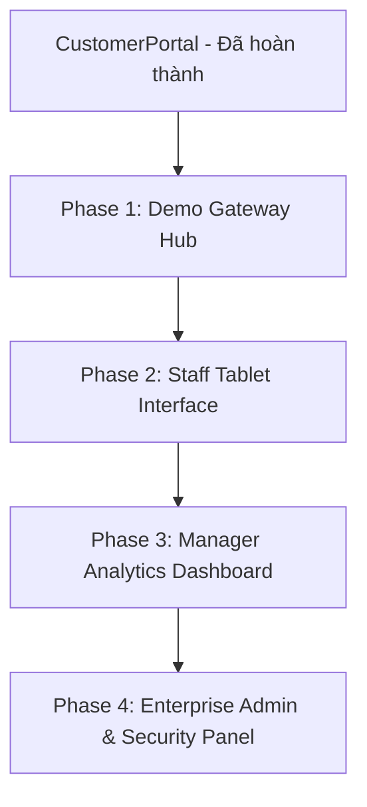

# STORAGE SYS - Master Design System & Redesign Roadmap

---

## 1. Design System Overview: Modern Tech SaaS

Hệ thống được chuyển đổi toàn diện từ phong cách cũ (*Warm Minimalist / Earth Tones*) sang phong cách **Modern Tech SaaS & Industrial Booking/Operations**. Thiết kế lấy cảm hứng từ các nền tảng công nghệ hàng đầu thế giới (Linear, Vercel, Stripe, Airbnb) kết hợp nét cá tính "Flight Terminal / Boarding Pass" cho các thông số kho bãi, kích thước và dữ liệu vận hành.

---

## 2. Design Tokens & Visual Language

### 2.1 Bảng màu (Color Palette)

| Phân loại | Mã màu / Tailwind Token | Mục đích sử dụng |
| :--- | :--- | :--- |
| **Dark Slate (Primary Dark)** | `bg-slate-900` (`#0f172a`), `bg-slate-800` (`#1e293b`) | Nền Hero banners, Sidebar chuyên dụng, Dark console logs |
| **Airy Light (Primary Light)**| `bg-slate-50` (`#f8fafc`), `bg-gray-50` (`#f9fafb`) | Nền ứng dụng chính, tạo cảm giác thoáng đãng, hiện đại |
| **Card Surface** | `bg-white` (`#ffffff`) | Thẻ nội dung, bảng biểu, hộp hội thoại |
| **Borders & Dividers** | `border-gray-200` (`#e2e8f0`), `border-slate-200` | Đường viền mảnh tinh tế, đường nét đứt kiểu vé boarding pass |
| **Tech Blue (Brand Accent)** | `bg-blue-600` (`#2563eb`), `text-blue-500` (`#3b82f6`), `bg-blue-50` | Nút bấm chính (CTA), liên kết nổi bật, trạng thái kích hoạt, icon điểm nhấn |
| **Status: Sẵn sàng / Active** | `bg-emerald-50 text-emerald-600 border-emerald-100` | Kho sẵn sàng, hợp đồng hoạt động, nhân viên online |
| **Status: Cảnh báo / Chờ** | `bg-amber-50 text-amber-600 border-amber-100` | Nhiệm vụ sắp tới hạn, bảo trì, cảnh báo |
| **Status: Khẩn cấp / Đã khóa**| `bg-rose-50 text-rose-600 border-rose-100` | Cổng lỗi, tài khoản bị khóa, hợp đồng quá hạn |

---

### 2.2 Quy chuẩn Typography (Typography Hierarchy)

1. **Display & Numbers Font (`Anton`):**
   - **Nguồn:** Google Font `'Anton', sans-serif`
   - **Phạm vi áp dụng:**
     - Tiêu đề Hero chính (ví dụ: `KHO LƯU TRỮ THÔNG MINH`)
     - Kích thước kho bãi (ví dụ: `5X5 FT`, `10X20 FT`)
     - Giá tiền (ví dụ: `$65`, `$119/tháng`)
     - Số liệu thống kê lớn / KPIs (ví dụ: `$84,250`, `92.4%`, `482`)
   - **Quy tắc bắt buộc:**
     - Luôn sử dụng `tracking-wide` (hoặc `tracking-normal`). **Tuyệt đối KHÔNG dùng `tracking-tighter`** để tránh các chữ cái và dấu tiếng Việt bị dính vào nhau.
     - Chiều cao dòng: Sử dụng `leading-[1.2]` hoặc `leading-snug`.
     - Với tiêu đề nhiều dòng, bọc từng dòng trong `` kết hợp `space-y-2`.

2. **Body & UI Font (`Inter`):**
   - **Nguồn:** `'Inter', sans-serif`
   - **Phạm vi áp dụng:** Menu điều hướng, nhãn phụ, mô tả, nội dung thẻ, bảng dữ liệu.
   - **Quy tắc:** `font-sans`, cân đối trọng số `font-normal` (400), `font-medium` (500), và `font-semibold` (600).

3. **Monospace Font (Logs & System Data):**
   - **Phạm vi:** Mã định danh (`CTR-8419`, `L-1049`), mốc thời gian ISO, địa chỉ IP trong trang Admin/Audit Log.

---

### 2.3 Thành phần giao diện cốt lõi (Core UI Components)

1. **Hero Container (Split Layout):**
   - Nền ảnh kho công nghệ cao với lớp phủ tối `bg-slate-900/85`.
   - Cột trái: Tiêu đề Anton ấn tượng, thanh tìm kiếm dạng Pill tròn `rounded-full`, huy hiệu bảo mật.
   - Cột phải: Khung trực quan với các thẻ nổi lơ lửng (`animate-float`, `animate-float-delay`) thể hiện tính năng 24/7, khóa an toàn, bảo hiểm.

2. **Boarding Pass Unit Cards:**
   - Bo góc `rounded-2xl`, viền mảnh `border border-gray-200`, đổ bóng mềm `shadow-sm hover:shadow-md`.
   - Ngăn cách giữa thông tin kho và phần giá bằng đường nét đứt `border-t-2 border-dashed border-gray-200`.
   - Nút hành động toàn chiều rộng màu xanh công nghệ `bg-blue-600 hover:bg-blue-700`.

3. **Hệ thống điều hướng thích ứng (Dual Navigation):**
   - **Desktop (md+):** Thanh điều hướng trên cùng `hidden md:flex justify-between items-center bg-white px-8 py-4 shadow-sm`.
   - **Mobile:** Thanh điều hướng cố định dưới đáy màn hình `md:hidden fixed bottom-0 w-full bg-white border-t pb-safe`.

---

## 3. Hiện trạng các trang & Phân tích khoảng cách (Gap Analysis)

| Phân hệ / Trang | Tệp nguồn | Trạng thái hiện tại | Vấn đề cần khắc phục |
| :--- | :--- | :--- | :--- |
| **Customer Portal** | `CustomerDashboard.tsx` | ✅ **Hoàn thành** | Đã chuyển sang phong cách Tech SaaS, fix typography Anton `tracking-wide` & `leading-[1.2]`. |
| **Demo Gateway** | `DemoGateway.tsx` | ⚠️ **Cần làm mới** | Đang dùng màu cũ (`#f2eee4`, `#c9a44b`, `#25352d`), không đồng bộ với thương hiệu Tech Blue & Slate. |
| **Staff Interface** | `StaffDashboard.tsx` | ⚠️ **Cần làm mới** | Tông màu xanh lá rêu và giấy cổ điển (`#25352d`, `#f2eee4`), chưa tối ưu trải nghiệm tablet hiện đại. |
| **Manager Dashboard** | `ManagerDashboard.tsx` | 🟡 **Cần hoàn thiện** | Đã có nền tảng xanh/slate nhưng chưa áp dụng font Anton cho KPIs lớn, thẻ thống kê còn cơ bản. |
| **Admin Panel** | `AdminPanel.tsx` | ⚠️ **Cần làm mới** | Giao diện mang hơi hướng editorial cũ với font có chân (`font-serif`) và nút màu đồng (`#c9a44b`). |

---

## 4. Kế hoạch Redesign chi tiết cho các trang còn lại

---

### Giai đoạn 1: Demo Gateway (`DemoGateway.tsx`) - Cổng trải nghiệm trung tâm

* **Mục tiêu:** Tạo ấn tượng công nghệ cao ngay từ cái nhìn đầu tiên khi người dùng truy cập dự án.
* **Chi tiết triển khai:**
  1. **Nền & Bố cục:**
     - Chuyển sang nền tối cao cấp `bg-slate-950` hoặc gradient `bg-gradient-to-b from-slate-900 via-slate-900 to-slate-950` với lưới công nghệ chấm mờ (subtle dot grid).
     - Header với huy hiệu thương hiệu `STORAGE SYS` rực sáng với badge công nghệ.
  2. **Thẻ điều hướng 4 phân hệ (Interactive Cards):**
     - Đổi sang cấu trúc thẻ kính mờ `bg-slate-900/60 backdrop-blur-md border border-slate-800 hover:border-blue-500/50`.
     - Phân định rõ từng vai trò với mã màu và biểu tượng hiện đại:
       - **Khách hàng (Customer):** Xanh Tech Blue (`text-blue-400`, viền phát sáng nhẹ).
       - **Nhân viên (Staff):** Xanh Cyan / Indigo (`text-cyan-400`).
       - **Quản lý (Manager):** Xanh Emerald (`text-emerald-400`).
       - **Quản trị viên (Admin):** Tím Violet (`text-violet-400`).
     - Áp dụng font **Anton** cho nhãn vai trò hoặc mã phân hệ (`PORTAL-01`, `PORTAL-02`...).
     - Hiệu ứng hover mượt mà với mũi tên trượt ngang và đổ bóng neon tinh tế.

---

### Giai đoạn 2: Staff Interface (`StaffDashboard.tsx`) - Bảng điều hành Tablet tại cơ sở

* **Mục tiêu:** Tối ưu hóa cho nhân viên vận hành kho bằng màn hình cảm ứng/tablet, phong cách công thái học, trực quan, thao tác nhanh.
* **Chi tiết triển khai:**
  1. **Thanh bên (Sidebar):**
     - Thay thế màu xanh rừng `#25352d` bằng `bg-slate-900 border-r border-slate-800`.
     - Icon màu sáng với trạng thái active bằng nền `bg-blue-600 text-white shadow-lg shadow-blue-600/30`.
  2. **Cột danh sách việc cần làm (Middle Pane):**
     - Nền `bg-slate-50 border-r border-gray-200`.
     - Thẻ công việc:
       - Đổi thẻ đang chọn (Active) sang `bg-slate-900 text-white shadow-md border-l-4 border-blue-500`.
       - Thẻ chưa chọn (Inactive) dùng `bg-white border border-gray-200 hover:border-blue-300 text-slate-800`.
       - Mã số kho (e.g. `UNIT #B14`) được hiển thị bằng font **Anton** `tracking-wide text-lg`.
  3. **Cột chi tiết nhiệm vụ (Right Pane):**
     - Bỏ màu nền giấy `#f2eee4`, thay bằng `bg-slate-50`.
     - Thẻ thông tin khách hàng và kho bãi: Nền `bg-white`, bo góc `rounded-2xl`, viền xám mảnh.
     - Các nút thao tác lớn:
       - Nút chính (Xác nhận nhận kho): `bg-blue-600 hover:bg-blue-700 text-white font-semibold shadow-md active:scale-95`.
       - Nút phụ (Báo cáo hư hại, Cập nhật trạng thái): Viền xám `border border-gray-300 bg-white hover:bg-gray-50 text-slate-700`.

---

### Giai đoạn 3: Manager Analytics Dashboard (`ManagerDashboard.tsx`) - Trung tâm điều hành & phân tích số liệu

* **Mục tiêu:** Nâng tầm báo cáo doanh thu, tỷ lệ lấp đầy kho và điều phối nhân sự thành một giao diện BI (Business Intelligence) chuẩn mực.
* **Chi tiết triển khai:**
  1. **Hàng thẻ chỉ số chính (KPI Stat Cards):**
     - Áp dụng font **Anton** `tracking-wide text-4xl` cho các con số tài chính: `$84,250`, `92.4%`, `482`.
     - Đặt các chip xu hướng tăng trưởng xanh lá `bg-emerald-50 text-emerald-600 font-semibold px-2.5 py-1 rounded-full text-xs`.
  2. **Biểu đồ doanh thu Recharts:**
     - Tinh chỉnh màu cột: Cột hiện tại dùng màu `bg-blue-600` với gradient nhẹ, các tháng trước dùng màu `slate-300`.
     - Tooltip hiện đại bo tròn với viền `border-slate-200` và đổ bóng cao cấp.
  3. **Bảng hợp đồng & Điều phối nhân viên:**
     - Mã hợp đồng (`CTR-8419`) định dạng Monospace rõ nét.
     - Nút "Điều động" và "Quản lý" đồng bộ phong cách với các nút trong CustomerPortal.

---

### Giai đoạn 4: Enterprise Admin & Security Panel (`AdminPanel.tsx`) - Bảng điều khiển bảo mật & phân quyền

* **Mục tiêu:** Chuyển đổi từ giao diện tạp chí cổ điển sang bảng điều khiển quản trị đám mây cao cấp (Cloud Security & IAM Console).
* **Chi tiết triển khai:**
  1. **Loại bỏ hoàn toàn phong cách cũ:**
     - Xóa bỏ `font-serif`, màu vàng đồng `#c9a44b`, và nền giấy `#f2eee4`.
     - Thiết lập nền toàn trang `bg-slate-50 text-slate-900`.
  2. **Header & Thanh Tabs:**
     - Logo `STORAGE SYS | ADMIN` với biểu tượng khiên bảo mật màu xanh `text-blue-600`.
     - Thanh chuyển tab dạng Pill trượt hiện đại hoặc Underline màu xanh công nghệ `bg-blue-600`.
  3. **Quản lý người dùng (Tab Users):**
     - Nút "Tạo tài khoản mới": `bg-blue-600 hover:bg-blue-700 text-white rounded-xl shadow-sm`.
     - Bảng thành viên: Thẻ avatar sắc nét, nhãn vai trò dạng Badge mềm `bg-blue-50 text-blue-700 font-medium`.
     - Nút khóa / mở khóa tài khoản có tooltip và hiệu ứng hover phản hồi rõ ràng.
  4. **Nhật ký hệ thống (Tab Audit Logs):**
     - Khung nhật ký kiểu Terminal hiện đại với nền `bg-slate-900 text-white rounded-2xl border border-slate-800`.
     - Đèn xung nhịp trực tiếp màu đỏ/xanh lá `animate-pulse`.
     - Định dạng IP, Timestamp, Transaction ID bằng `font-mono` với độ tương phản cao, dễ tra cứu sự cố an ninh.

---

## 5. Check-list kiểm thử chất lượng sau mỗi giai đoạn (Quality Checklist)

- [ ] **Typography:** Không tồn tại lớp `tracking-tighter` gây dính chữ; các tiêu đề/chỉ số lớn dùng `Anton` có `tracking-wide` và khoảng cách dòng thông thoáng.
- [ ] **Màu sắc:** Tuyệt đối loại bỏ các mã màu cũ (`#f2eee4`, `#c9a44b`, `#25352d`, `font-serif`).
- [ ] **Tính nhất quán:** Các nút bấm chính thống nhất dùng `bg-blue-600`, bo góc `rounded-xl` hoặc `rounded-2xl`.
- [ ] **Responsive:** Hoạt động trơn tru trên mọi độ phân giải (Mobile, Tablet ngang/dọc, Desktop màn rộng).
- [ ] **Hiệu năng & Build:** Lệnh `npm run build` chạy thành công không có lỗi TypeScript hay JSX cú pháp.
